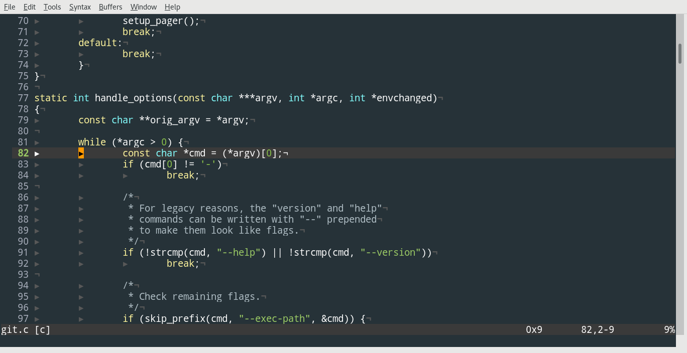

A Vim color scheme that clones the color selection in Christoph Paulik's
Emacs theme:

	http://github.com/cpaulik/emacs-material-theme

Which in turn is based on Google's Material Design:

	https://material.io/guidelines/style/color.html#

It does not support terminals without 256 color support.

Highlighting support depends on the syntax groups defined by Vim for each
language. For example, Vim does not define a syntax group for C variables.

Check /usr/share/vim/vim80/syntax to see what's defined for your favorite
language.

You can add support for missing syntax groups by extending the syntax file that
ships with Vim. For example, to highlight functions in C place the following in
$HOME/.vim/after/syntax/c.vim:

	" Highlight all function names
	syntax match cCustomFunc /\w\+\s*(/me=e-1,he=e-1
	highlight link cCustomFunc Function
